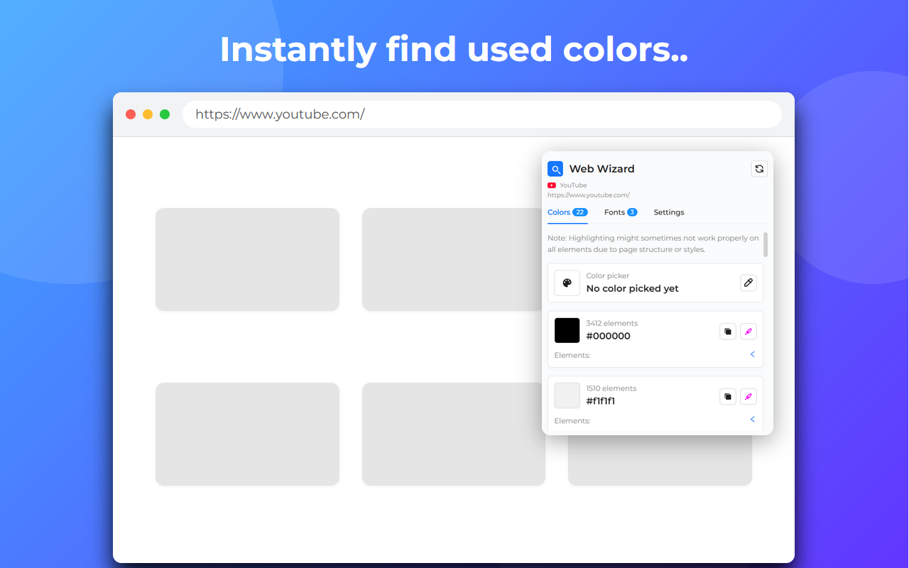
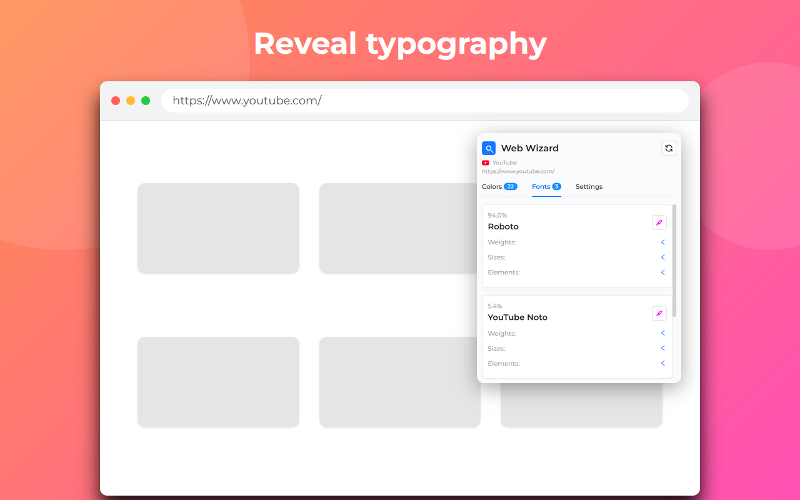

# Web Wizard

[](LICENSE)

[](https://chromewebstore.google.com/detail/web-wizard/ggflldlhnfejonaclfmfmhnpgliijicn)
[](https://addons.mozilla.org/en-US/firefox/addon/webwizard/)

<p>
  <b>Analyze website designs – instantly reveal color palettes and typography choices with a single click.<br>
  Perfect for designers and developers.</b>
</p>

## Features
- 🎨 &nbsp;**Scan used colors & fonts**, _Instantly see all colors and fonts used on the current page._
- ✨ &nbsp;**Highlight a found color on webpage**, _Visually highlight any detected color directly on the page._
- 🔠 Highlight fonts, Visually emphasize fonts used on the page for quick identification.
- 📋 &nbsp;**Copy a color**, _Copy any color value in your preferred format (HEX, RGB, HSL) with one click._
- 🔄 &nbsp;**Change format of found colors**, _Switch between HEX, RGB, and HSL formats for easy copying._
- 🌗 &nbsp;**Toggle between light & dark mode**, _Choose the theme that fits your workflow._
- 🖍️ &nbsp;**Change highlight color**, _Customize the highlight color for better visibility._
- 🏷️ &nbsp;**See where colors and fonts are used**, _View which elements use each color or font._
- #️⃣ &nbsp;**Count of colors and percentage of fonts**, _Get statistics on color usage and font distribution._
- 🧩 Collapse elements tab, Easily hide or show the elements panel to declutter your view.

## Screenshots




## Installation

1. Clone or download this repository.
2. Install dependencies:
   ```bash
   npm install
   ```
3. Build for production:
   ```bash
   npm run build
   ```
4. Open your browser's extensions page (e.g., `chrome://extensions/`).
5. Enable "Developer mode".
6. Click "Load unpacked" and select the `/dist` directory.

## Support

If you find this project helpful, you can [buy me a coffee](https://buymeacoffee.com/lunthn) to support ongoing development!

